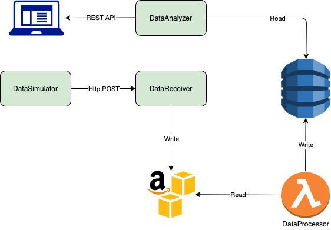
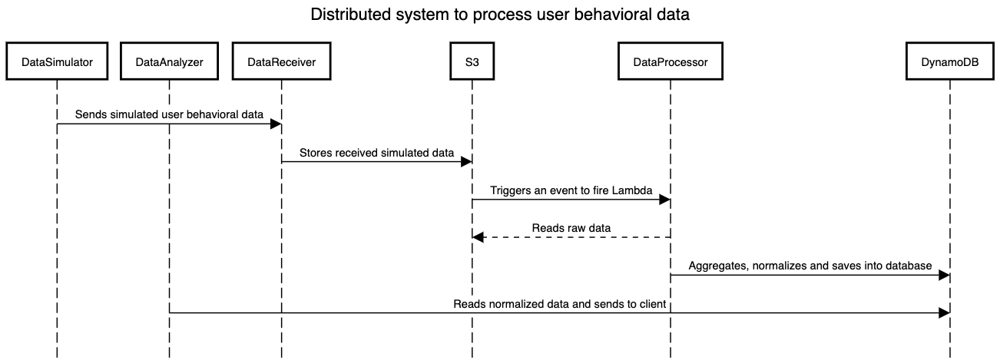

## Introduction

The DataProcessor is a Lambda function. The responsibility of this function is to read user behavioral raw data from S3, normalize it, aggregate and then store in DynamoDB. This Lambda function is being triggered when a new object is being added to the specific bucket that it listens to(for more info see the sequence diagram).

## Architecture diagram of the whole system

## Sequence diagram of the whole system

#### Datastores
1. Amazon S3 - The function reads raw data from S3 to normalize and aggregate it
2. DynamoDB - The function uses persistent database to save processed data for further usage.

#### Environmental variables      
| ENV Variable | Description |
| ------------ | ----------- |
| NODE_ENV | Environment in which microservice will run. |
| AWS_ACCESS_KEY_ID | AWS credential to access S3 |
| AWS_SECRET_ACCESS_KEY | AWS credential to access S3 |
| AWS_S3_BUCKET_NAME | The bucket name from where the function reads raw that |

#### Run service locally
###### In order to run service, follow these simple steps:
    1. npm install
    2. Provide list of env variables in 'root/.env-dev' file with following format: envVar=value
    3. npm start

#### Maintainer contact
- vahagsaribeyan@gmail.com
